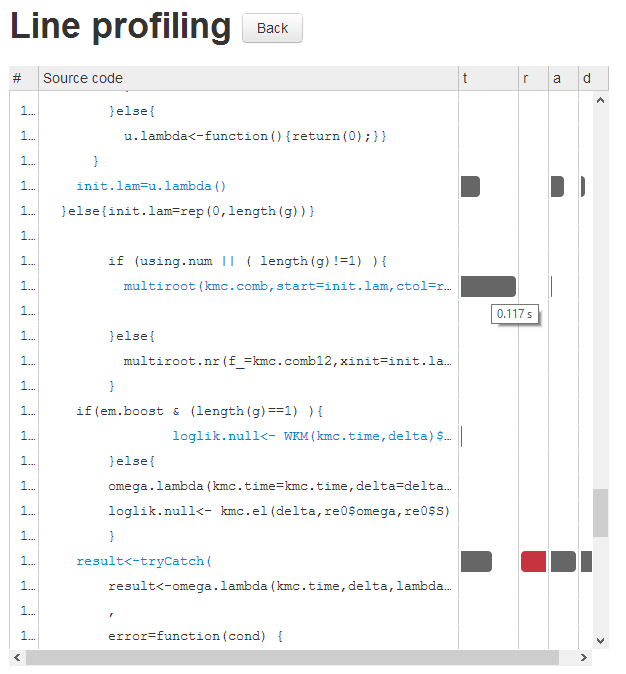
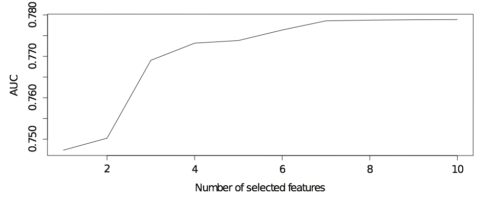
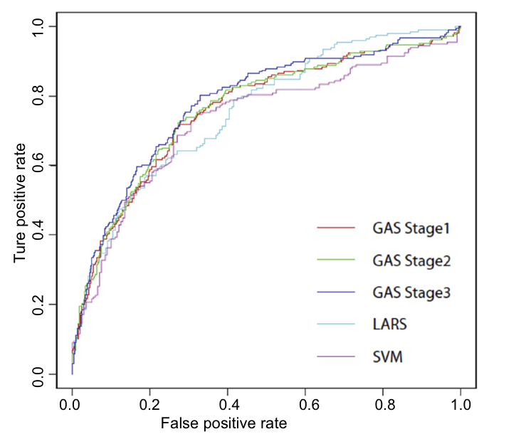

BioStaCs
===========
Data manupilating/Analytic tools for GWAS data.

Data Clean
-----------------------
The following needs to be integrated in our projects.

1. C/Cpp
2. Python/perl
3. R
4. Java

TODO LIST:

1. Use text files to store files: csv/txt.
2. Offering ***README*** file which includes
 - Data description
 - Colum description (types: Numeric/Categorical/Ordered; cate: What is the var? )
 - Header/No headr  
3. State how to handle NA/NULL/missing value


</hr>

R code Analysing
-----------------

Additional package is need:

```r
# R>3.0
library(devtools)
devtools::install_github("lineprof")
devtools::install_github("shiny-slickgrid", "wch")
```

To use it, one can try

```r
#library(lineprof)
#source(find_ex("read-delim.r"))
#wine <- find_ex("wine.csv")
#x <- lineprof(read_delim(wine, sep = ","), torture = TRUE)
#shine(x)
```

It will open an web page such as




The profile information can show more details.


Memory Strategy
---------------------

There are some built-in function in this package to monitor/clean memory
> Built-in functions    
>> ```lsos()``` shows the memory usage with neat format;    
>>  ```showMemoryUse()``` shows memory usage and performs a ```gc()``` automatically.

Besides,

> Outer Packages    
>> ```bigalgebra``` BIGMEM    
>> ```biganalytics``` BIGMEM    
>> ```bigmemory``` BIGMEM    
>> ```bigtabulate``` BIGMEM    
>> ```synchronicity``` BIGMEM    


GAS
-------------

GAS (Greedy AUC Stepwise) is a classification framework, which is successfully applied our [SpermatogenesisOnline project](http://mcg.ustc.edu.cn/bsc/spermgenes). In binary classification problem, GAS maximizes ROC curve with pregiven number of variables automatically, which aims to solve a K-Sparse problem by finding the best K features using greedy searching that maximizes AUC. The strategy of GAS is similar to forward selection, which only adds one variable that is not already in the model and increases the value of AUC. If GAS fails to find out the solution with K variables, it will output the model that generates the maximum AUC instead For each step with maximum allowed numbers.



